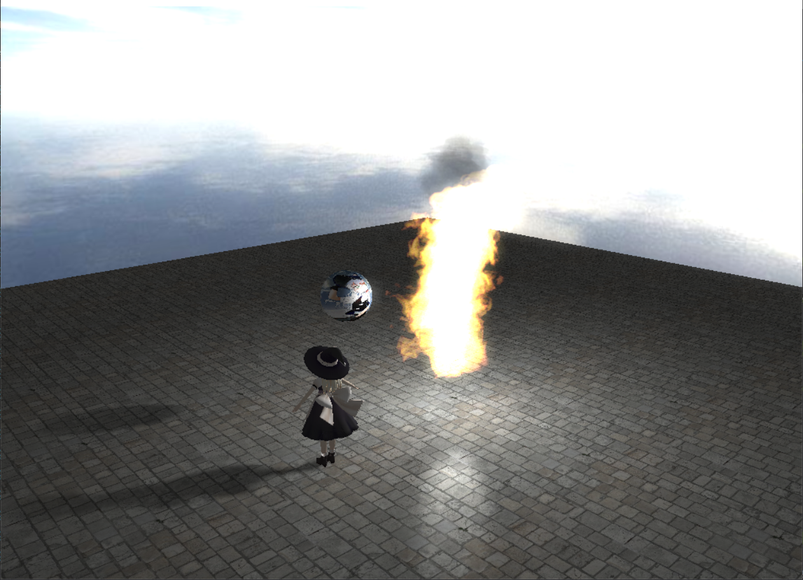

# VulkanGraphicsEngine
基于Vulkan的封装引擎框架



## 重构后的代码框架

图片库：WIC和STBImage，封装了基于WIC的立方体图
模型库：Assimp，可稳定加载的模型格式有obj（不带动画），fbx（带动画）
渲染效果：基于CPU的简易粒子效果和Bloom屏幕特效，PCF阴影

## Scene类的正确打开方式
初始化：
```
//初始化场景系统
scene.vkInfo = &vkInfo;

mainCamera = Camera((float)vkInfo.width / (float)vkInfo.height);
mainCamera.LookAt(glm::vec3(0.0f, 0.0f, 0.0f), glm::vec3(0.0f, 0.0f, 1.0f), glm::vec3(0.0f, 1.0f, 0.0f));

scene.SetAmbientLight(glm::vec4(0.3f, 0.3f, 0.3f, 0.3f));
scene.SetMainCamera(&mainCamera);

//创建一个点光
scene.SetPointLight(glm::vec3(1.0f, 1.0f, 0.0f), glm::vec3(1.0f, 1.0f, 1.0f), 1.0f, 10.0f);
```
创建物体对象：
```
  //利用Texture辅助库加载图片
	std::vector<std::unique_ptr<Texture>> textures;
	std::string texturePath[] = {
		"Assets\\brickTexture.jpg",
		"Assets\\icon.jpg"
	};
	for (size_t i = 0; i < 2; i++) {
		auto texture = std::make_unique<Texture>();
		LoadPixelWithSTB(texturePath[i].c_str(), 32, *texture, &vkInfo.device, vkInfo.gpu.getMemoryProperties());
		texture->SetupImage(&vkInfo.device, vkInfo.gpu.getMemoryProperties(), vkInfo.cmdPool, &vkInfo.queue);
		texture->CleanUploader(&vkInfo.device);
		textures.push_back(std::move(texture));
	}
  
  //创建用于光照的材质
	Material brick_mat;
	brick_mat.name = "brick";
	brick_mat.diffuse = textures[0].get();
	brick_mat.diffuseAlbedo = glm::vec4(1.0f, 1.0f, 1.0f, 1.0f);
	brick_mat.fresnelR0 = glm::vec3(0.5f, 0.5f, 0.5f);
	brick_mat.roughness = 0.01f;
	brick_mat.matTransform = glm::mat4(1.0f);

	Material sphere_mat;
	sphere_mat.name = "sphere";
	sphere_mat.diffuse = textures[1].get();
	sphere_mat.diffuseAlbedo = glm::vec4(1.0f, 1.0f, 1.0f, 1.0f);
	sphere_mat.fresnelR0 = glm::vec3(0.05f, 0.05f, 0.05f);
	sphere_mat.roughness = 0.8f;
	sphere_mat.matTransform = glm::mat4(1.0f);
  
  //将材质添加进场景中
	scene.AddMaterial(brick_mat);
	scene.AddMaterial(sphere_mat);
  
  //利用GameObject类创建场景中的物件
	GameObject plane_obj;
	plane_obj.name = "plane";
	plane_obj.material = scene.GetMaterial("brick");
	plane_obj.transform.position = glm::vec3(0.0f, -1.0f, 0.0f);

	GameObject sphere_obj;
	sphere_obj.name = "sphere";
	sphere_obj.material = scene.GetMaterial("sphere");
	sphere_obj.transform.position = glm::vec3(0.0f, 1.0f, 2.0f);
  
  //将物体添加进场景当中
	scene.AddGameObject(plane_obj, 0);
	scene.AddGameObject(sphere_obj, 0);
  
  //为物体添加渲染组件
	//使用GeometryGenerator库来辅助创建几何体
	GeometryGenerator geoGen;
	GeometryGenerator::MeshData plane_mesh = geoGen.CreatePlane(30.0f, 30.0f, 10, 10);
	scene.AddMeshRenderer(scene.GetGameObject("plane"), plane_mesh.vertices, plane_mesh.indices);
	GeometryGenerator::MeshData sphere_mesh = geoGen.CreateGeosphere(0.5f, 8);
	scene.AddMeshRenderer(scene.GetGameObject("sphere"), sphere_mesh.vertices, sphere_mesh.indices);
```
修改Start方法和Update方法

## 天空盒和阴影贴图
设定场景的天空盒：
```
//加载立方体贴图
	Texture cubeMap;
	LoadCubeMapWithWIC(L"Assets\\skybox.png", GUID_WICPixelFormat32bppRGBA, cubeMap, &vkInfo.device, vkInfo.gpu.getMemoryProperties());
	cubeMap.SetupImage(&vkInfo.device, vkInfo.gpu.getMemoryProperties(), vkInfo.cmdPool, &vkInfo.queue);
	cubeMap.CleanUploader(&vkInfo.device);
  
/*初始化天空盒*/
	scene.SetSkybox(cubeMap, 0.5f, 8);
```
第一个参数为Texture对象，后两个参数为球体的细分参数

设定场景的阴影图：
```
scene.SetShadowMap(width, height, lightDirection, radius);
```

## 骨骼蒙皮动画
```
/*使用SkinnedModel类加载带有蒙皮动画的模型*/
	SkinnedModel model("Assets\\skinnedModel.fbx");

	//使用图片的文件名称作为GameObject的名称
	std::vector<std::string> meshNames;

	std::vector<std::unique_ptr<Texture>> modelTextures;
	for (size_t i = 0; i < model.texturePath.size(); i++) {
		auto texture = std::make_unique<Texture>();
		meshNames.push_back(model.texturePath[i].substr(model.texturePath[i].find_last_of('\\') + 1, model.texturePath[i].length() - 1));
		
		//使用STB库加载模型下的所有贴图并为其创建材质
		LoadPixelWithSTB(model.texturePath[i].c_str(), 32, *texture, &vkInfo.device, vkInfo.gpu.getMemoryProperties());
		texture->SetupImage(&vkInfo.device, vkInfo.gpu.getMemoryProperties(), vkInfo.cmdPool, &vkInfo.queue);
		texture->CleanUploader(&vkInfo.device);
		modelTextures.push_back(std::move(texture));

		Material material;
		material.name = meshNames[i];
		material.samplerType = SamplerType::border;
		material.diffuse = modelTextures[i].get();
		material.diffuseAlbedo = glm::vec4(1.0f, 1.0f, 1.0f, 1.0f);
		material.fresnelR0 = glm::vec3(0.0f, 0.0f, 0.0f);
		material.matTransform = glm::mat4(1.0f);
		material.roughness = 0.8f;
		scene.AddMaterial(material);
	}

	//创建一个GameObject作为模型的父物件
	GameObject modelObject;
	modelObject.name = "marisaModel";
	modelObject.transform.position = glm::vec3(-2.0f, -1.0f, 0.0f);
	modelObject.transform.scale = glm::vec3(0.1f, 0.1f, 0.1f);
	//modelObject.transform.localEulerAngle = glm::vec3(-glm::pi<float>() * 0.5f, 0.0f, 0.0f);
	scene.AddGameObject(modelObject, 0);

	//创建骨骼动画实例并添加到场景（放在添加SkinnedMeshRenderer之前）
	std::vector<int> boneHierarchy;
	std::vector<glm::mat4x4> boneOffsets;
	std::vector<glm::mat4x4> nodeOffsets;
	std::unordered_map<std::string, AnimationClip> animations;

	model.GetAnimations(animations);
	model.GetBoneHierarchy(boneHierarchy);
	model.GetBoneOffsets(boneOffsets);
	model.GetNodeOffsets(nodeOffsets);

	for (auto& animation : animations) {
		for (uint32_t i = 0; i < animation.second.boneAnimations.size(); i++)
			animation.second.boneAnimations[i].defaultTransform = nodeOffsets[i];
	}

	SkinnedModelInstance skinnedModelInst;
	skinnedModelInst.clipName = "default";
	skinnedModelInst.skinnedInfo.Set(boneHierarchy, boneOffsets, animations);
	skinnedModelInst.finalTransforms.resize(boneOffsets.size());
	scene.AddSkinnedModelInstance(skinnedModelInst);

	//加载模型的所有的Mesh并添加到modelObject下
	for (size_t i = 0; i < model.renderInfo.size(); i++) {
		GameObject childObject;
		childObject.name = meshNames[i];
		childObject.material = scene.GetMaterial(meshNames[i]);
		scene.AddGameObject(childObject, scene.GetGameObject("marisaModel"));
		scene.AddSkinnedMeshRenderer(scene.GetGameObject(meshNames[i]), model.renderInfo[i].vertices, model.renderInfo[i].indices);
	}
```

## 基于CPU的简易粒子系统
```
/*创建粒子效果*/
	//创建粒子的材质(粒子不参与光照所以不需要指定光照参数)
	Material flame_mat;
	flame_mat.name = "flame";
	flame_mat.diffuse = textures[2].get();
	scene.AddMaterial(flame_mat);

	Material smoke_mat;
	smoke_mat.name = "smoke";
	smoke_mat.diffuse = textures[3].get();
	scene.AddMaterial(smoke_mat);

	//创建两个GameObject分别代表粒子和子粒子
	GameObject flameObject;
	flameObject.name = "flame";
	flameObject.material = scene.GetMaterial("flame");
	flameObject.transform.position = glm::vec3(1.0f, 1.0f, 0.0f);
	scene.AddGameObject(flameObject, 0);

	GameObject smokeObject;
	smokeObject.name = "smoke";
	smokeObject.material = scene.GetMaterial("smoke");
	smokeObject.transform.position = glm::vec3(0.0f, 1.0f, 0.0f);
	scene.AddGameObject(smokeObject, scene.GetGameObject("flame")); //设为flame的子物件

	//初始化火焰的粒子系统
	ParticleSystem::Property property;
	property.maxSize = 5.0f;
	property.minSize = 4.0f;
	property.minLastTime = 0.5f;
	property.maxLastTime = 2.0f;
	property.maxVelocity = glm::vec3(0.0f, 1.0f, 0.0f);
	property.minVelocity = glm::vec3(0.0f, 1.0f, 0.0f);
	property.minAlpha = 0.9f;
	property.maxAlpha = 1.0f;
	property.colorFadeSpeed = 0.5f;
	property.sizeFadeSpeed = 1.0f;
	property.color = glm::vec3(0.0f, 0.0f, 0.0f);
	ParticleSystem::Emitter emitter;
	emitter.maxParticleNum = 10;
	emitter.position = glm::vec3(0.0f, 0.0f, 0.0f);
	emitter.radius = 0.3f;
	ParticleSystem::Texture particleTexture;
	particleTexture.splitX = 7;
	particleTexture.splitY = 7;
	particleTexture.texCount = 7 * 7;
	ParticleSystem::SubParticle subParticle;
	subParticle.color = glm::vec3(0.0f, 0.0f, 0.0f);
	subParticle.lastTime = 2.0f;
	subParticle.texture.splitX = 6;
	subParticle.texture.splitY = 6;
	subParticle.texture.texCount = 6 * 6;
	subParticle.size = 2.0f;
	subParticle.used = true;
	scene.AddParticleSystem(scene.GetGameObject("flame"), scene.GetGameObject("smoke"), property, emitter, particleTexture, subParticle);
```

## 简易的Bloom特效
```
//设定
PostProcessingProfile::Bloom bloomProfile;
bloomProfile.criticalValue = 0.5f;    //亮度阈值
bloomProfile.blurOffset = 0.003f;     //高斯模糊偏移
bloomProfile.blurRadius = 5;          //高斯模糊半径
scene.SetBloomPostProcessing(bloomProfile);
```
此步骤应放在SetupDescriptors之前

## 与Scene封装无关的辅助方法

### 加载图片类
使用WIC加载图片：
```
LoadPixelWithWIC(texturePath[i].c_str(), 32, texture, &vkInfo.device, vkInfo.gpu.getMemoryProperties());
texture.SetupImage(&vkInfo.device, vkInfo.gpu.getMemoryProperties(), vkInfo.cmdPool, &vkInfo.queue);
```
使用WIC加载立方体图：
```
LoadCubeMapWithWIC(texturePath[i].c_str(), 32, texture, &vkInfo.device, vkInfo.gpu.getMemoryProperties());
texture.SetupImage(&vkInfo.device, vkInfo.gpu.getMemoryProperties(), vkInfo.cmdPool, &vkInfo.queue);
```
使用STB加载图片：
```
LoadPixelWithSTB(texturePath[i].c_str(), 32, texture, &vkInfo.device, vkInfo.gpu.getMemoryProperties());
texture.SetupImage(&vkInfo.device, vkInfo.gpu.getMemoryProperties(), vkInfo.cmdPool, &vkInfo.queue);
```

### 加载模型类
```
/*使用Model类加载没有蒙皮动画的模型*/
	Model model("Assets\\model.fbx");
	//使用图片的文件名称作为GameObject的名称
	std::vector<std::string> meshNames;

	std::vector<std::unique_ptr<Texture>> modelTextures;
	for (size_t i = 0; i < model.texturePath.size(); i++) {
		auto texture = std::make_unique<Texture>();
		meshNames.push_back(model.texturePath[i].substr(model.texturePath[i].find_last_of('|') + 1, model.texturePath[i].length() - 1));
		
		//使用STB库加载模型下的所有贴图并为其创建材质
		LoadPixelWithSTB(model.texturePath[i].c_str(), 32, *texture, &vkInfo.device, vkInfo.gpu.getMemoryProperties());
		texture->SetupImage(&vkInfo.device, vkInfo.gpu.getMemoryProperties(), vkInfo.cmdPool, &vkInfo.queue);
		texture->CleanUploader(&vkInfo.device);
		modelTextures.push_back(std::move(texture));

		Material material;
		material.name = meshNames[i];
		material.diffuse = modelTextures[i].get();
		material.diffuseAlbedo = glm::vec4(1.0f, 1.0f, 1.0f, 1.0f);
		material.fresnelR0 = glm::vec3(0.0f, 0.0f, 0.0f);
		material.matTransform = glm::mat4(1.0f);
		material.roughness = 0.8f;
		scene.AddMaterial(material);
	}

	//创建一个GameObject作为模型的父物件
	GameObject modelObject;
	modelObject.name = "morisaModel";
	modelObject.transform.position = glm::vec3(-2.0f, -1.0f, 0.0f);
	modelObject.transform.scale = glm::vec3(0.1f, 0.1f, 0.1f);
	modelObject.transform.localEulerAngle = glm::vec3(-glm::pi<float>() * 0.5f, 0.0f, 0.0f);
	scene.AddGameObject(modelObject, 0);

	//加载模型的所有的Mesh并添加到modelObject下
	for (size_t i = 0; i < model.renderInfo.size(); i++) {
		GameObject childObject;
		childObject.name = meshNames[i];
		childObject.material = scene.GetMaterial(meshNames[i]);
		scene.AddGameObject(childObject, scene.GetGameObject("morisaModel"));
		scene.AddMeshRenderer(scene.GetGameObject(meshNames[i]), model.renderInfo[i].vertices, model.renderInfo[i].indices);
	}
```
